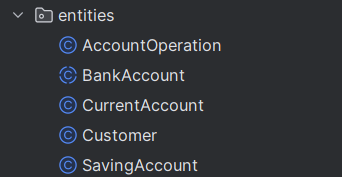
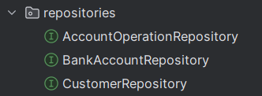
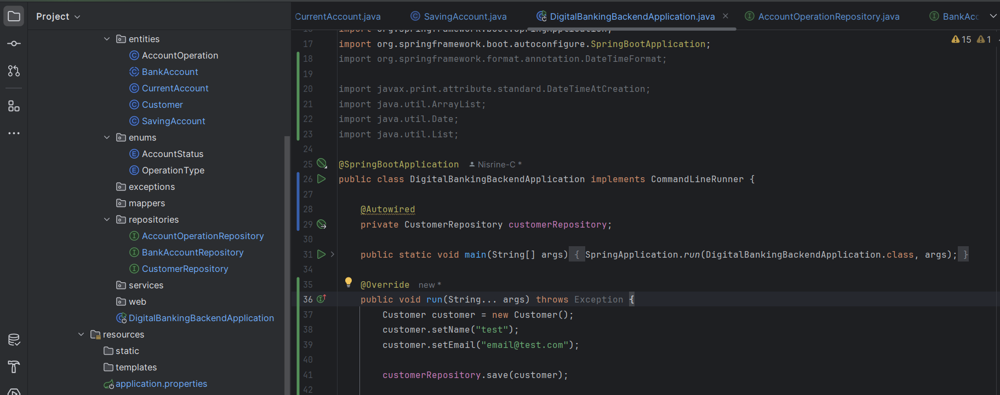
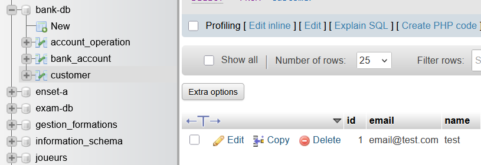

# Backend

This spring boot app is meant to be a RestFul API for a Digital Banking Website. 
In the application each Account belongs to a user and can have multiple transactions whether they be of the type **CREDIT** or **DEBIT**.
The account can be categorised into two types **CURRENT**, and **SAVINGS**.

### The First step is to create the relevant JPA entities as follows:
<br/>

Following this model :

   ```java
    @Entity
    @Inheritance(strategy = InheritanceType.SINGLE_TABLE)
    @DiscriminatorColumn(name = "TYPE",length = 4)
    @Data @NoArgsConstructor @AllArgsConstructor
    public abstract class BankAccount {
        @Id
        private String id;
        //Attributes
    }
   ```
***To be noted :*** Current and Savings Account inherits from BankAccount

### After that we create the repository interfaces needed for this app, namely:
<br/>


Following this model :
   ```java
@Repository
public interface CustomerRepository extends JpaRepository<Customer,Long> { @Query("select c from Customer c where c.name like :kw")
    List<Customer> searchCustomer(@Param("kw") String keyword);
}
   ```
#### Quick DAO test 
Extending from the interface commandLineRunner, use the run method to create a test entity and repository and then save it, in this example I used Customer:




### Next up I created the corresponding DTOS

RestController
Tester les web services Restful

