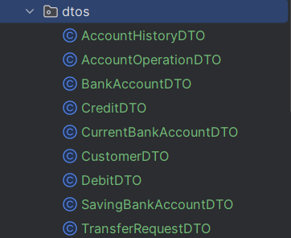
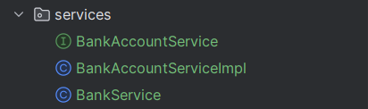
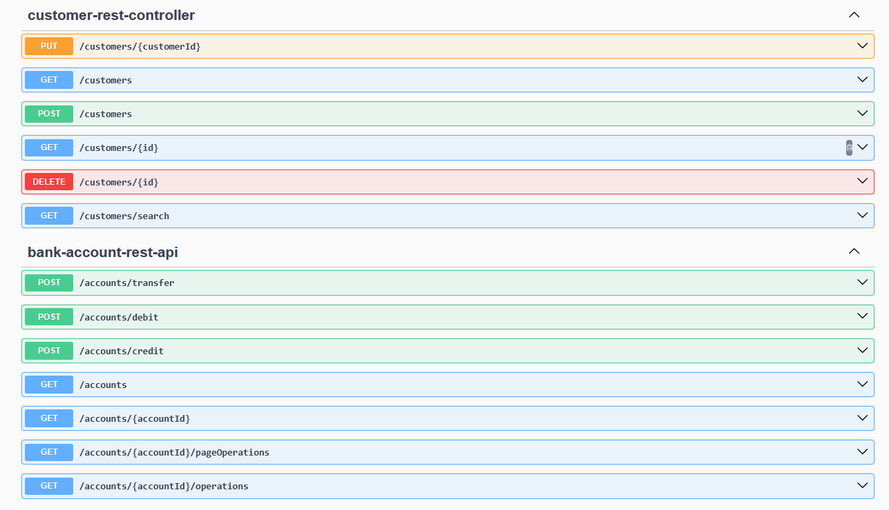

# Digital Banking Application-Backend

This spring boot app is meant to be a RestFul API for a Digital Banking Website.
In the application each Account belongs to a user and can have multiple transactions whether they be of the type **CREDIT** or **DEBIT**.
The account can be categorised into two types **CURRENT**, and **SAVINGS**.

# Summary

1. [Entity Layer](#the-first-step-is-to-create-the-relevant-jpa-entities-as-follows)
2. [Repository Layer](#after-that-i-created-the-repository-interfaces-needed-for-this-app-namely)
3. [DAO Layer Test](#quick-dao-test)
4. [DTO Layer](#next-up-i-created-the-corresponding-dtos)
5. [Mapper Layer](#next-i-created-the-corresponding-mappers)
6. [Service Layer](#then-i-created-the-service-layer)
7. [Controller Layer](#finally-i-created-the-rest-controllers)
8. [RestfulAPI Test](#api-test)

### The First step is to create the relevant JPA entities as follows:

<br/>

Following this model :

```java
 @Entity
 @Inheritance(strategy = InheritanceType.SINGLE_TABLE)
 @DiscriminatorColumn(name = "TYPE",length = 4)
 @Data @NoArgsConstructor @AllArgsConstructor
 public abstract class BankAccount {
     @Id
     private String id;
     //Attributes
 }
```

**_To be noted :_** Current and Savings Account inherits from BankAccount

### After that I created the repository interfaces needed for this app, namely:

<br/>


Following this model :

```java
@Repository
public interface CustomerRepository extends JpaRepository<Customer,Long> { @Query("select c from Customer c where c.name like :kw")
 List<Customer> searchCustomer(@Param("kw") String keyword);
}
```

#### Quick DAO test

Extending from the interface commandLineRunner, use the run method to create a test entity and repository and then save it, in this example I used Customer:


### Next up I created the corresponding DTOS

<p>
DTOs or Data Transfer Objects are objects that carry data between processes in order to reduce the number of method calls
</p>
<br/>

<br/>

### Next, I created the corresponding Mappers

<p>
Mappers are used to convert between the Entity classes and the DTOs. 
This is crucial because while the Entities map directly to database tables, 
DTOs are optimized for communication with external apps via API.
</p>

Following this format:

```java
@Service
public class BankAccountMapperImpl {
    public CustomerDTO fromCustomer(Customer customer){
        //code
    }
    public Customer fromCustomerDTO(CustomerDTO customerDTO){
        //code
    }
    public SavingBankAccountDTO fromSavingBankAccount(SavingAccount savingAccount){
        //code
    }
    public SavingAccount fromSavingBankAccountDTO(SavingBankAccountDTO savingBankAccountDTO){
        //code
    }
    public CurrentBankAccountDTO fromCurrentBankAccount(CurrentAccount currentAccount){
        //code
    }
    public CurrentAccount fromCurrentBankAccountDTO(CurrentBankAccountDTO currentBankAccountDTO){
        //code
    }
    public AccountOperationDTO fromAccountOperation(AccountOperation accountOperation){
        //code
    }
}
```

<br/>

### Then, I created the Service Layer

<p>
The Service layer is where the business logic of the application is implemented. I
t acts as a bridge between the Controllers and the Repositories.
</p>


Example of service implementation:

```java
public class BankAccountServiceImpl implements BankAccountService {
    private CustomerRepository customerRepository;
    private BankAccountRepository bankAccountRepository;
    private AccountOperationRepository accountOperationRepository;
    private BankAccountMapperImpl dtoMapper;

    @Override
    public CustomerDTO saveCustomer(CustomerDTO customerDTO) {
        //implementation
    }
    @Override
    public CurrentBankAccountDTO saveCurrentBankAccount(double initialBalance, double overDraft, Long customerId) throws CustomerNotFoundException {
        //implementation
    }
    @Override
    public SavingBankAccountDTO saveSavingBankAccount(double initialBalance, double interestRate, Long customerId) throws CustomerNotFoundException {
        //implementation
    }
    //The rest of the implementation is in the src
}
```

<br/>

### Finally, I created the Rest Controllers

<p>
The web layer (Controllers) gives access to the backend via a Restful API . 
</p>
<p>
These are the entry points for frontend clients to interact with the backend.
</p>

<br/>

### DigitalBankingBackendApplication

<p>
Finally, the main class `DigitalBankingBackendApplication` is the entry point of the Spring Boot application. It contains the `main()` method that starts up the entire application context.
</p>


### API Test

Now to test the endpoints, using swaggerUI:
